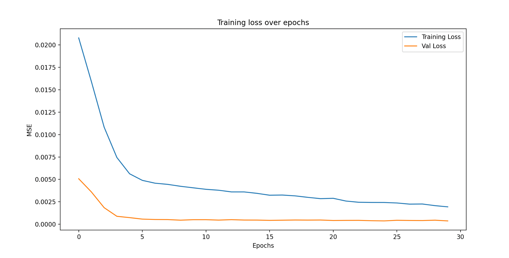
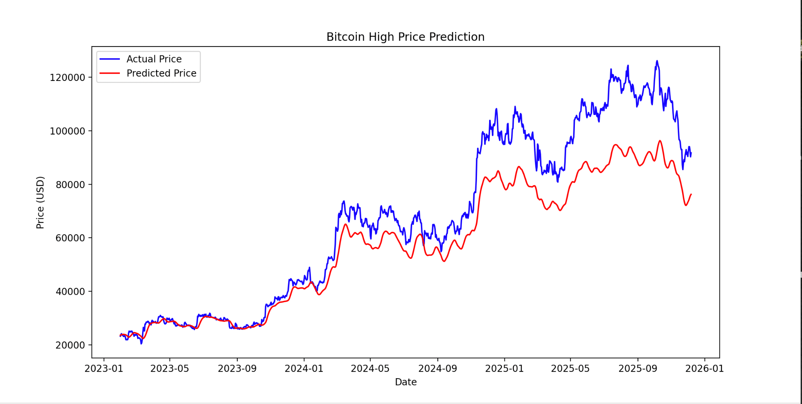

# Bitcoin Price Forecasting: LSTM
*Time-Series Modeling*

### Key Takeaways

- Built a forecasting pipeline using yfinance BTC data with chronological split and
windowed sequences

- LSTM successfully captured general trends but struggled when encounter unseen
patterns

## 1. Executive Summary

This project addresses time-series forecasting on financial markets. I implemented an LSTM
model trained on time series data of Bitcoin price from 2019 to current day. The model
successfully captured time trends with healthy training behavior but demonstrated inherent
limitations when new spikes in price were observed.

## 2. Approach & Methodology

### Motivation

Time-series forecasting is a core ML skill used in demand planning, inventory, pricing, and risk
management. Bitcoin is a challenging real-world series because it is noisy, non-stationary, and
regime-driven, making it a good example for learning sequential modeling.
### Data

To access real bitcoin price data, I used the yfinance library to import bitcoin price from the
beginning of 2019 to the most current price available.
### Data Processing

For timeseries-forecasting, I used a 30-day window, where the model uses past 30 days of
"high" prices of bitcoin to predict the next day's price. Data was scaled using MinMaxScaler
between 0 and 1. Date from January 2019 to December 2022 was used for training, and data
from January 2023 to present was used for testing.

### Models

A sequential LSTM architecture with 2 layers of LSTM layers of 50 nodes with dropout layers
with dropout rate 0.2 was followed by 1 dense layer of 25 nodes with ReLU activation, and
finally 1 node layer for the output. The model was compiled with Adam optimizer with learning
rate = 1e-4 and loss="mean_squared_error".

### Evaluation

To evaluate the performance of the model, I created a plot comparing the actual price and the
predicted price. In addition, the RMSE, root mean squared error, was computed as a measuring
statistic.

## 3. Result & Analysis

**Figure 1: LSTM training loss (mean squared error) over epochs**

The LSTM model displayed healthy training behavior reflected through the training loss and
validation loss over epochs. The figure above shows a sharp drop in training loss in the first few
epochs and a steady decrease for the remaining epochs, which correlates with the drop in
validation loss that stays very low.

**Figure 2: LSTM Bitcoin High Price actual vs predicted Bitcoin price (2023-2025)**

This figure shows the values of actual price and predicted price by the model. This shows that
the model was successful in finding the patterns of price change throughout the time. The model
generated accurate predicted prices especially during the early periods. However, when there is
a sudden stark increase in price, the model seems to output a lower predicted price than actual,
underestimating the change in price afterwards.
Finally, the output returned RMSE of  10353.39.

### Discussion

The results of this model illustrate both the advantages and disadvantages of the LSTM model.
The model evidently learns the patterns correctly and predicts accurate predictions. However,
figure 2 highlights a critical weakness. The model struggles when it encounters patterns not
seen from the training data, such as sudden spikes and new all-time highs observed in the test
period. This is a classic example of bias-variance trade-off, where the model is overfit to the
training data, having low bias, resulting in high variance when generalizing to unseen test data.
This may contribute to the RMSE that seems to be high. However, considering the bitcoin prices
in the test period range from $20,000 to $100,000, an error of $10,353 is roughly 10% average
error, which is contextually reasonable.

A method to improve the result may be increasing the window size, perhaps to 60 days. This will
allow the model to look back 60 days instead of 30, which means the model will be given more
context on long-term trends. Also, these results reinforce the importance of feature scaling.
Unscaled data can cause activation functions like sigmoid or tanh to saturate with high
magnitude data, causing vanishing gradients. The optimizer will focus on features with large
magnitudes, destabilizing learning. Another important factor of using LSTM is the temporal
structure of data. Since the LSTM architecture is specialized for time series data where the
gates and cells of the model learn and store patterns over extended sequences, preserving
temporal structure is key to train successfully and get accurate results.

## 4. Outlook / Future Enhancements

This model showed some decrease in performance for later periods due to unseen trends from
training data such as spike in prices. A solution to this can be adding more inputs such as S&P
500 index or sentiment data to add more context and connection to macroeconomic changes
rather than relying solely on past price change trends of bitcoin. Also, differencing the data to
predict the change in price rather than the absolute price can also yield better results.
