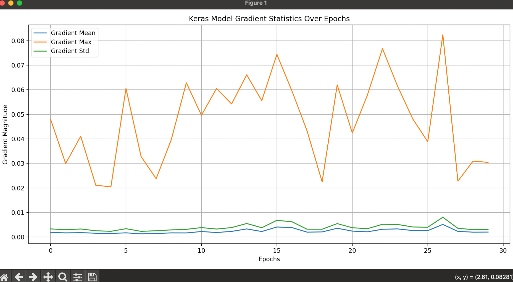

# Telco Churn: Model Benchmarking +
*Lightweight Inference Pipeline*

AUC-based Model selection + training diagnostics
### Key Takeaways

- Best validation performance: Gradient Boosting AUC = 0.843 (highest among tested
models)
- Logistic Regression nearly matched (AUC = 0.842), indicating strong linear signal
- Keras MLP trained stably but did not beat tree ensembles on tabular data
- Final takeaway: choose a model based on business constraints (interpretability vs
marginal AUC gains)
## 1. Executive Summary

This project addresses binary classification on structured customer churn data. I compared
several traditional Scikit-Learn models to a Keras MLP neural network. The Gradient Boosting
Classifier returned the best performance with AUC of 0.8434, outperforming the neural network
with AUC of 0.8336. This shows that ensemble tree-based models excel on structured, tabular
data compared to neural networks.
## 2. Approach & Methodology

### Motivation

Customer churn is a key metric that directly impacts revenue because acquiring new customers
typically costs more than retaining existing ones. A churn model helps prioritize retention actions
for the company by identifying customers with the highest churn risk, thus preventing extra
expense on recouping lost customers. In practice, the objective is not just to maximize a metric,
but to build a model that is accurate and reliable for decision-making.

By comparing multiple ML models, I attempt to study how different models perform on the same
dataset. Linear models tend to capture global trends efficiently, while tree ensembles can model
nonlinear feature interactions, and neural networks may require different representations to
excel on tabular data. This comparison helps explain why certain models perform better.
### Data

I used the ‘Telco Customer Churn' dataset available on kaggle.
https://www.kaggle.com/datasets/blastchar/telco-customer-churn

### Data Processing

To handle mixed data types, the given customer churn data was addressed by a dual pipeline
for numeric features, imputed using median values and scaled using StandardScaler, and for
categorical features, imputed using most frequent values and encoded using OneHotEncoder.
The target variable is Churn where Yes is mapped to 1 and No is mapped to 0. Numeric
features are standardized to mean 0 and variance 1.
### Models

I trained Logistic Regression, Random Forest classifier, Gradient Boosting classifier, SGD
classifier, and Keras MLP.
For each models, the parameters were:
Logistic Regression: max_iter=500
Random Forest classifier: n_estimators=100, random_state=42
Gradient Boosting classifier: n_estimators=100, random_state = 42
SGD Classifier: loss= "log_loss", random_state = 42
Keras MLP:
- 
3 dense layers with ReLU activation with 32,16,8 nodes each and 1 layer with sigmoid
activation
- 
Compiled with loss="binary_crossentropy", optimizer=adam, metrics=["AUC","accuracy"]

Other parameters were left with default.
### Evaluation

Models were compared based on AUC (Area Under the ROC Curve) on a validation set that
was 20% of data. I tracked gradient statistics including mean, max, and std during training to
monitor training performance.
For the final model selection, I set the criteria for choosing keras over scikit-learn models to be
having higher AUC for accuracy, and mean gradient between 0.00001 and 0.05 and maximum
gradient smaller than 1 to make sure the model didn't display vanishing or/and exploding
gradients.
## 3. Result & Analysis

My experiments revealed that the Gradient Boosting Classifier was the best model for this
dataset.

### Table 1: Model Performance Leaderboard

| Model | Type | AUC |
|---|---|---:|
| Gradient Boosting Classifier | sklearn | 0.8434 |
| Logistic Regression | sklearn | 0.8419 |
| SGD Classifier | sklearn | 0.8296 |
| Random Forest Classifier | sklearn | 0.8162 |
| keras_mlp | keras | 0.8336 |

The Neural network performed well, but it did not outperform Gradient Boosting model and even
Logistic Regression. The SGD Classifier was the next best, and the Random Forest Classifier
had the worst performance.

**Figure 1: Gradient magnitudes over 30 epochs of learning**

The gradient magnitude plot shows a healthy behavior. The mean and standard deviations of
gradients remain very low but not 0, and the maximum gradient shows spikes that are controlled
between 0.02 and 0.08. This shows that the model is consistently learning in a controlled
behavior without the case of vanishing or exploding gradients. In the last epoch, the model had
a gradient mean of 0.0016, maximum gradient of 0.0431, and standard deviation of 0.0028.

### Discussion

- Tree ensembles performed best, likely because they capture nonlinear feature
interactions common in churn behavior.
- Logistic Regression remained competitive, suggesting many churn patterns are linearly
separable after preprocessing.
- Neural networks did not outperform ensembles here, consistent with tabular benchmarks
where boosting methods often dominate unless feature engineering or large-scale

representation learning is used.

- 
I chose Gradient Boosting Classifier as the final model because it achieved the highest
validation AUC, outperforming other Scikit-learn models and keras MLP. Although the neural
network's gradients were healthy, the tree model delivered the best discrimination with simpler
deployment.

The Gradient Boosting Classifier's best performance is consistent with established research
indicating that tree-based ensemble methods often outperform neural networks on structured
tabular data. This advantage is due to the nature of structured tabular data, where features are
pre-selected based on domain expertise by engineers. In these cases, tree-based models
perform better in finding distinct feature patterns with relatively lower computational complexity
than deep neural networks. Since Gradient Boosting is a non-linear model, it is fit for finding
complex rules that humans might miss such as interactions between different features.
Conversely, neural networks tend to require significantly larger datasets in order to meet the
same level of performance. With a lack of massive amounts of data, neural networks are prone
to overfit.

The Logistic Regression had a surprisingly impressive performance where the AUC was
practically tied with Gradient Boosting. This performance suggests that the features may have a
simple, linear relationship with the churn rate, allowing a simple Logistic Regression to achieve
high accuracy.This reinforces the principle that increased model complexity does not always
guarantee better performance.

Balancing interpretability, accuracy, and deployment simplicity is often the toughest task in
model selection. Typically, there is a negative relationship between interpretability and accuracy,
and a positive relationship between interpretability and deployment simplicity. Complex models
like neural networks and gradient boosting usually outperform simple logistic regression at the
cost of easy interpretability. Logistic regression returns coefficients that directly quantify the
relationship to outcome variables, while weights and biases in neural networks provide little
direct insight. As model complexity increases,deployment becomes more resource intensive.
Yet, my results deviated from this norm, where the Gradient Boosting Classifier achieved the
highest accuracy as expected, but the Logistic Regression followed extremely closely,
outperforming neural networks. This suggests that our structural tabular data is well-suited for
certain traditional machine learning models we used, possibly due to the data being
predominantly linear. In real-world context, the marginal gain in AUC for gradient boosting may
not justify the interpretability and deployment simplicity of Logistic Regression.

## 4. Outlook / Future Enhancements

I compared several methods to see which one performs the best. To improve the result further, I
can combine well performing models to average the predictions to receive higher accuracy than
a single model. Also, since currently I just use the raw data formatted to fit the model, I can
attempt to improve the features. Perhaps with more domain knowledge, I can create interaction
features or advanced features that provide greater performance.

### References

Grinsztajn, L., Oyallon, E., & Varoquaux, G. (2022). Why do tree-based models still outperform
deep learning on tabular data? arXiv preprint arXiv:2207.08815.
