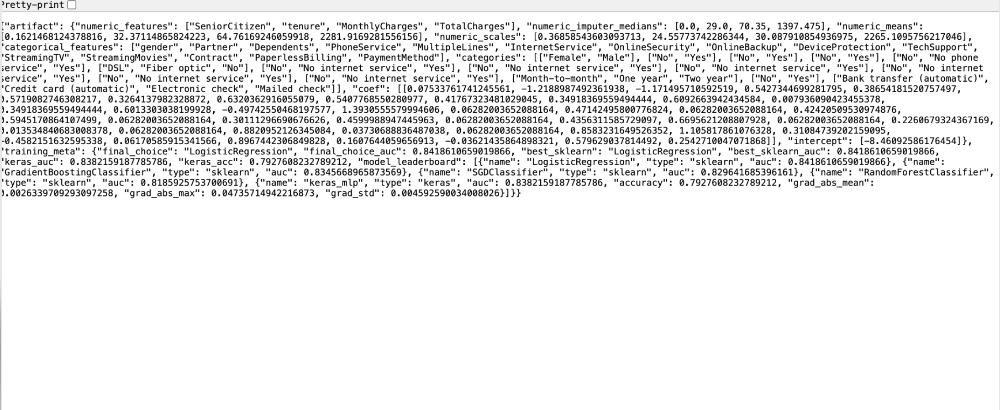
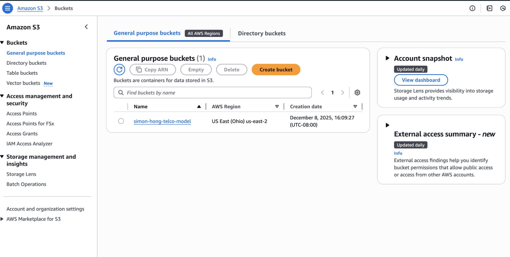
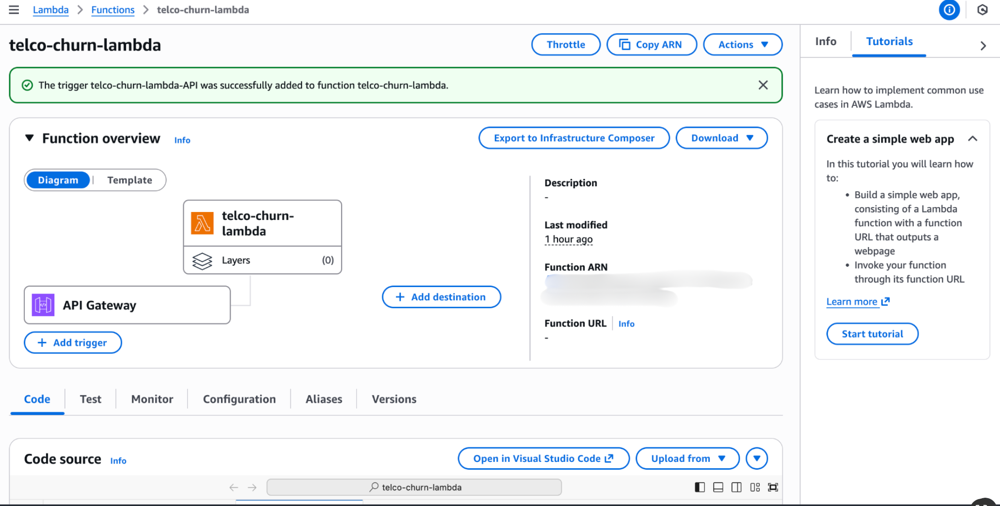
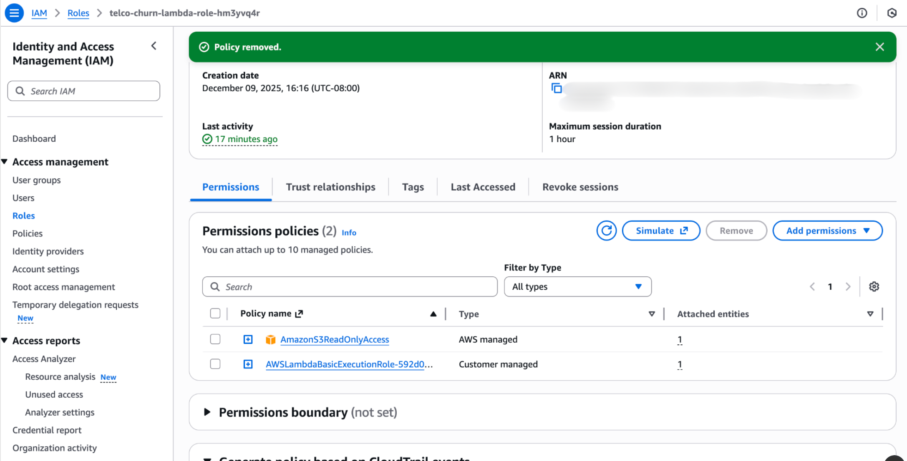
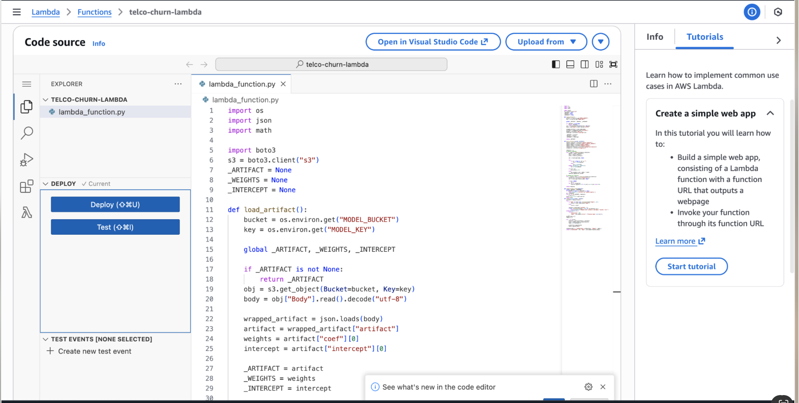
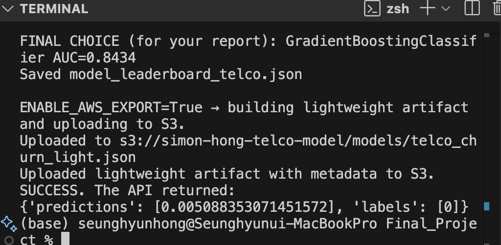

# Serverless Churn Scoring Artifact (AWS S3 + Lambda + API Gateway)
*Lightweight model artifact + inference pipeline*

## 1. Executive Summary

I successfully deployed the churn model as an automated AWS pipeline connected to my
original code. Using AWS S3 and Lambda, I built a serverless inference system that loads the
lightweight model artifact from main code and returns predictions via API Gateway.

## 2. Approach & Methodology

I uploaded the lightweight artifact to AWS S3, used AWS Lambda with boto3 library to load the
artifact from S3, parse the input payload, and return predictions via API Gateway. This
architecture aims to extend this project beyond local analysis, but implement a serverless,
automated inference pipeline. This system allows real-time churn predictions on new customer
data without requiring persistent server or local dependencies. The aim was lightweight, where
we used an extracted linear model.

I aimed to achieve repeatable preprocessing, minimal dependencies, and standardized
behavior. Benefits of keeping lightweight artifacts is to reduce dependency constraints as
Lambda packaging makes heavy ML libraries harder to ship and maintain, reduce time and
improve latency, and maximize consistency by only exporting what inference needs.

### Architecture

The architecture follows the pipeline flow of S3, Lambda, and API Gateway. S3 serves as the
model registry where the trained model parameters including weights, intercepts, and scaling
factors are transformed to a JSON artifact and uploaded to S3 bucket. Then, the function in
Lambda is triggered, which downloads the artifact and reconstructs the model to compute
probability. Then, the API Gateway takes the Lambda function to the public and allows the client
to request prediction.

**Figure 1: Lightweight JSON artifact uploaded to S3**

### Implementation

The key to this challenge was to keep everything lightweight for easy deployment. That means it
is difficult to install libraries to AWS Lambda. So, I trained an SGD classifier locally using
Scikit-Learn, extracted the key coefficients and statistics through the artifact, and let Lambda do
this directly.

### Amazon S3

I created a bucket with the name ‘simon-hong-telco-model'. This works as the centralized model
registry, which automatically uploads the artifact when the main script from my local device
finishes.

**Figure 2: Amazon S3 bucket**

AWS Lambda
I set the runtime to Python 3.14. Custom lambda functions including lambda_handler is used to
fetch the JSON artifact from S3, which then applies the linear formula for SGD Classifier, and
returns the prediction. I granted IAM permission to allow reading access to S3, and connect API
Gateway as a method to stream the result out.

**Figure 3: AWS Lambda**

**Figure 4: AWS Lambda IAM Permissions**

**Figure 5: Custom lambda function uploaded to AWS Lambda**

API Gateway
I used HTTP API, which provides a public URL to trigger the Lambda function securely over
AWS.

### Workflow

The pipeline is fully automated within the lambda functions in the main script
telco_churn_final.py. The workflow starts at training and building the SGD Classifier from the
main script. Then, the upload_json_to_s3() function builds and uploads it to S3 using the boto3
library. The script then automatically selects a random sample customer for testing. The script
sends POST requests to API Gateway URL with the customer data, where the Lambda
processes the request using uploaded artifact and returns the Churn probability and label.

**Figure 6: Automated AWS Pipeline execution result**

This figure serves as the verification of success for the end-to-end pipeline. The local training
script automatically triggered the API with a sample customer, and returned a prediction with the
correct label, confirming infrastructure is fully operational.

Security note: Any live endpoints, keys, or account identifiers are intentionally
excluded/redacted from the public repository. The repository focuses on architecture, artifact
format, and reproducible inference code.
